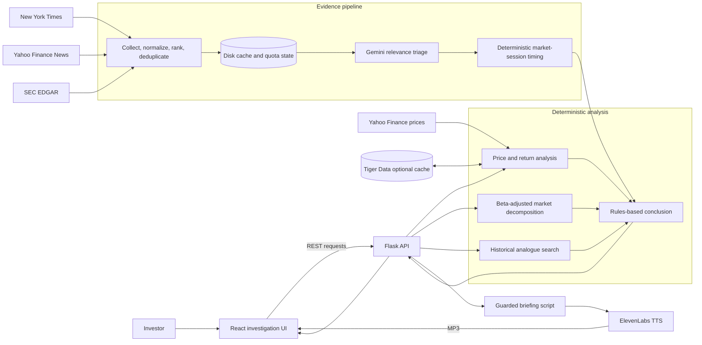

# FinSight — Investigation Mode

ShellHacks 2026 · Blackstone "Reimagining the Investor Experience"

> We don't tell you what to invest in. We help you investigate what happened.

Search any traded ticker, pick which session to investigate, and follow a five-card investigation:

1. **How unusual:** percentile and z-score vs 5 years of daily moves
2. **Company or market:** ticker vs its sector ETF vs SPY, intraday, with a beta-adjusted idiosyncratic move
3. **Evidence timeline** — NYT and Yahoo Finance reporting plus SEC filings, deduplicated and ranked before Gemini triages the items that bear on the move
4. **Has this happened before:** the closest past moves and their +1/+5/+20-day returns
5. **Deterministic conclusion:** a rules-based synthesis of the move, market decomposition, time-filtered evidence, and historical comparisons

The interface adds a sticky section navigator, light and dark themes, and an ElevenLabs voice
briefing with 1×, 1.5×, and 2× playback. The evidence timeline opens as a focused detail view
without leaving the single-page application.

The conclusion makes no additional Gemini request. It renders immediately from the price
calculations, then updates when the existing timeline triage finishes. If triage is unavailable,
it withholds any catalyst claim while preserving the numerical market analysis.

## Architecture



The numerical verdict and final conclusion are computed by application code. Gemini is used
to triage evidence and produce guarded briefing context; it cannot replace the calculated
stock-specific versus market-wide classification. Publication timing is also enforced in code,
so reporting published after the session cannot be presented as its cause.

## Which session gets investigated

- **Latest session** — the most recent *completed* trading day.
- **Most unusual** — the largest absolute move in the last 30 trading days.

The most recent trading day is derived from the price data itself, never from the calendar,
so weekends *and* market holidays are handled by one rule. When the investigated session is
not today, the UI says so and why — a stale investigation never presents itself as a live
one. During an open session the figures are labelled live and update on refresh.

Reference demo: `META` in **Most unusual** lands on **Mon, Sep 21, 2026 — +11.43%,
99.4th percentile, z = 4.0**.

## The evidence timeline

Route: `/#s=NVDA&m=unusual&view=timeline`, linked from every investigation.

The look-back window depends on the mode: **6 months** for a latest-session move (a recent
move needs recent context) and **5 years** for an unusual one (that session may be 30+
trading days old and needs the long view).

A NYT window that long cannot be fetched in one call. Article Search returns at most 100 results
per query and sorts only by `newest` or `oldest`, so a single 5-year request comes back
holding only the last fortnight. The window is split into **calendar-year cells** and one page
is sampled from each, which is what makes the timeline span its range instead of clustering
at one end.

**You should never wait for this.** `/api/timeline` only ever reads from disk; sampling runs
on a background thread and the page polls until it settles. Opening an investigation kicks off
the warm immediately, so by the time you click through to the timeline the evidence is
usually already there. Results are published per cell, so the timeline fills in progressively
rather than sitting blank. A cold 5-year warm takes ~75s in the background and **0.003s per
poll** while it happens.

You can also pre-warm from the CLI, which is worth doing before a demo:

```bash
cd backend
python ingest.py NVDA unusual --timeline
```

### What it costs, and why it is not more

NYT allows 500 requests/day and 5/minute. At 5/minute the requests *are* the cost, so the
sampler is built around not making them:

| | before | now |
|---|---|---|
| Cold 5-year warm | 10 requests | **6** |
| Repeat visit, same ticker | 10 again | **0** |
| Switch modes (5yr warm already cached) | 10 | **≤1** |
| Page load while warming | blocked 60–135s | **~3ms** |

- **Calendar-aligned cell cache.** Every (term, year-cell, page) is cached on disk
  individually. A second visit costs nothing, an interrupted warm resumes, and because the
  6-month window lives inside a cell the 5-year window already cached, the two modes share
  work.
- **A hard daily budget.** Spend is persisted to `backend/.cache/nyt_budget.json` and stops at
  400/day, clear of the real 500 cap. A long test session degrades to cached data instead of
  erroring, and never sleeps when everything is already cached.
- **Three-source candidate cap.** NYT, Yahoo Finance News, and SEC EDGAR records are
  normalized, deduplicated, relevance-ranked, and capped at 60 total candidates before the
  single Gemini call. Per-source caps prevent one feed from crowding out the others.
- **Partial results over exceptions.** A rate-limited or unavailable source keeps whatever
  the other sources collected.

### The stock-specific vs market-wide verdict

The headline verdict is *not* left to the model. It comes from the beta-adjusted
decomposition (`conclusion.scope_verdict`): the share of the move the market's beta does not
explain. Gemini triages the evidence — keeping only items that plausibly bear on the move,
labelling each `stock` / `sector` / `market`, rating significance, writing a thesis — and is
asked to argue that number rather than invent one. If it disagrees, the disagreement is
surfaced instead of silently swapping the verdict.

### API quotas are the binding constraint

- **NYT** — 500 requests/day, 5/min. Sampler stops itself at 400/day.
- **Yahoo Finance News** — no additional key; responses are cached and deduplicated.
- **SEC EDGAR** — no key; set `SEC_USER_AGENT` to identify the app, as SEC guidance requests.
- **Gemini free tier** — **20 requests/day.** One timeline triage is one request.

When Gemini is unavailable or selects no articles, the timeline still lets users browse
sampled coverage, clearly marked **unreviewed**. These items are separate from AI-selected
evidence and never count as established catalysts in the conclusion. The verdict is still
computed from prices. Triage uses bounded requests and the configured fallback model.
Incomplete sampling and failed triage wait 10 minutes before automatic retry (including
across backend restarts); **Re-sample** explicitly retries. Cached AI citations are tied to
the exact article pool, so a changed pool cannot silently reuse a different article's ID.

Regression checks: `python -m unittest discover -s backend -p 'test_*.py'`.

## Run locally

```bash
cp .env.example backend/.env        # fill in keys
pip install -r backend/requirements.txt
python backend/app.py               # API on :5001

cd frontend && npm install && npm run dev   # UI on :5173, proxies /api
```

Optional: pre-load a ticker into Tiger Data (needs `DATABASE_URL`; add `NYT_API_KEY` for
headlines in the tight window).

```bash
cd backend
python ingest.py                    # default ticker, latest session
python ingest.py NVDA unusual       # ticker + mode
python ingest.py NVDA --no-news     # skip the NYT call to save quota
```

The API port is 5001 because macOS AirPlay Receiver occupies 5000 and answers
`403 Forbidden` to every request, which surfaces in the UI as
"Couldn't load investigation: API 403". To use a different port, set `PORT` and change the
target in `frontend/vite.config.js` to match.

Every key is optional for a first run. Without `DATABASE_URL` the chart is computed from
yfinance in memory. Without `NYT_API_KEY`, Yahoo Finance news and SEC filings still load.
Missing Gemini or ElevenLabs keys show an inline error. Ticker search and all price analysis
work with no keys at all.

Repeat searches reuse a cached bundle for 5 minutes, so browsing around does not trip
Yahoo's rate limits. **↻ Refresh** forces a virgin fetch.

### Deep links

```
/#s=NVDA&m=unusual
/#s=META&m=latest
/#s=NVDA&m=unusual&view=timeline
```

## Deploy (DigitalOcean App Platform)

**Current status:** deployment-ready, but not publicly deployed. The repository contains the
App Platform specification; the DigitalOcean app still needs to be created and given its
runtime secrets.

One Docker service. It builds React, then Flask/gunicorn serves both the API and `frontend/dist`.

```bash
doctl apps create --spec .do/app.yaml
```

Set `DATABASE_URL`, `NYT_API_KEY`, `GEMINI_API_KEY`, and `ELEVENLABS_API_KEY` in the App
Platform UI. After the initial app is created, pushes to `main` deploy automatically because
`.do/app.yaml` sets `deploy_on_push: true`. Replace this section with the public URL after the
first successful deployment.
